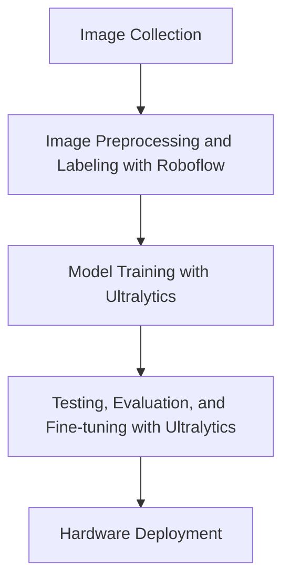

## Object Detection

An easy way to create a custom object detection model is by using [RoboFlow](https://roboflow.com/) and [Ultralytics' YOLOV8 Library](https://github.com/ultralytics/ultralytics/). Here's the process:

Object Detection Pipeline:



#### Image Collection 
Gather images. Consider using [image data sets](https://docs.ultralytics.com/datasets/), APIs from image sites and [Roboflow Universe](https://universe.roboflow.com/). Aim for 200+ clear, high quality images.

#### Image Labeling with Roboflow

Use Roboflow to label your images (draw bounding boxes around classes you want to detect). This can be done manually or automated by tools such as [Roboflow Annotate](https://roboflow.com/annotate). 

#### Data Preprocessing with Roboflow
Remove any images which are of poor quality or not ideal for model training. Use Roboflow to split your dataset into Training/Validation/Testing subsets. 

If desired, Roboflow can also be used to apply [image transformations](https://docs.roboflow.com/datasets/image-preprocessing) and [augment](https://docs.roboflow.com/datasets/image-augmentation) the raw images in the dataset. 

Once done, make sure to Roboflow exports the dataset in the **YOLOv8 Format**. The export's file structure should be similar to this:

```
├───test
│   ├───images
│   └───labels
├───train
│   ├───images
│   └───labels
├───valid
│   ├───images
│   └───labels
│
│───data.yaml     <--- Note this filename.
.
.
```

Note the name of the `.yaml` file as it will be needed for training.


#### Environment Setup for Ultralytics YOLOv8

```bash
# Creating a virtual Python environment is optional, but recommended to 
# isolate any installed packages from the rest of your system.
python -m venv <directory-name>

# Source activate file for your OS. 
source myvenv/bin/activate          # For Linux
venv\Scripts\activate.bat           # For Windows CMD

# Install the Ultralytics Python package.
pip install ultralytics
```

#### Working with Ultralytics YOLOv8

Following code was adapted from the [Ultralytics Documentation](https://docs.ultralytics.com/).

```python
from ultralytics import YOLO

# Load the default, pretrained YOLOv8 Nano Model.
model = YOLO('yolov8n.pt')

# Train and fine-tune the default model on your custom dataset.
# Specify the path to the .yaml file in your Roboflow export.
training_results = model.train(data='your-roboflow-file.yaml', epochs=3)

# Evaluate model with validation set
validation_results = model.val()

# Specify an inference source (.jpg, webcam frame, Youtube URL, image directory, etc.)
inference_source = 'test-image.jpg'

# Test model on source and display source with results (bounding boxes). 
model.predict(inference_source, show=True)
```

#### Hardware Deployment

Once the model is sufficiently trained, use `export()` to export the model to a format suitable for your hardware.
```python
 model.export(format='tflite') # Export to TensorFlow Lite
```

Refer to this script to use the custom model on real-time footage from the Intel RealSense D435i.


#### Further Resources

- [Robflow Quickstart](https://blog.roboflow.com/getting-started-with-roboflow/)
- [Roboflow Documentation](https://docs.roboflow.com/)
- [Ultralytics Quickstart](https://docs.ultralytics.com/quickstart/)
- [Ultralytics Documentation](https://docs.ultralytics.com/)
